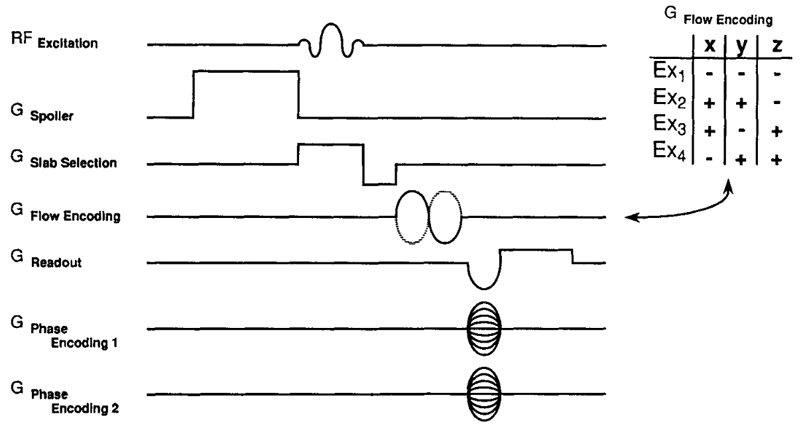

# Hadamard encoding beyond ASL

## 1. multi-slice imaging

Glover introduced the hadamard encoding methods into MRI in 1980s. Multi-slice acquisition methods was implemented as an alternative of interleave acquisition[^1]. Similar to 3D acqustion, higher SNR was found in multi-slice excitation compared to 2D excitation. However, there is a major disadvantage[^3]. Since the SNR improvement was introduced by the post processing, for N-step encoding scheme, the SNR was improved by $\sqrt{N}$ for anatomy images, while the scan time was increased to $N$.

To overcome the above problem, ky-dependent phase shift was introduced by the RF pulses to separate the images from multiple slices[^3]. As shown in the equation below, the $$y_0$$ is the designed distance between images. 

$$R'(t,k_y)=R(t)e^{ik_yy_0}$$

## 2. phase-encoding

In a phase-encoding sequence, the flow was encoded by the bipolar gradient direction. But the flow component along the gradient direction have the maximum sensitivity. In contrast the orthogonal flow was not encoded. Therefore, hadamard encoding was also proposed to x, y, z directions by Ash et al[^2].

  

[^1]:Souza SP, Szumowski J, Dumoulin CL, Plewes DP, Glover G. SIMA: simultaneous multislice acquisition of MR images by Hadamard-encoded excitation. J Comput Assist Tomogr. 1988 Nov-Dec;12(6):1026-30. PMID: 3183105.
[^2]:Dumoulin CL, Souza SP, Darrow RD, Pelc NJ, Adams WJ, Ash SA. Simultaneous acquisition of phase-contrast angiograms and stationary-tissue images with Hadamard encoding of flow-induced phase shifts. J Magn Reson Imaging. 1991 Jul-Aug;1(4):399-404. doi: 10.1002/jmri.1880010403. PMID: 1790361.

[^3]:Glover GH. Phase-offset multiplanar (POMP) volume imaging: a new technique. J Magn Reson Imaging. 1991 Jul-Aug;1(4):457-61. doi: 10.1002/jmri.1880010410. PMID: 1790368.
